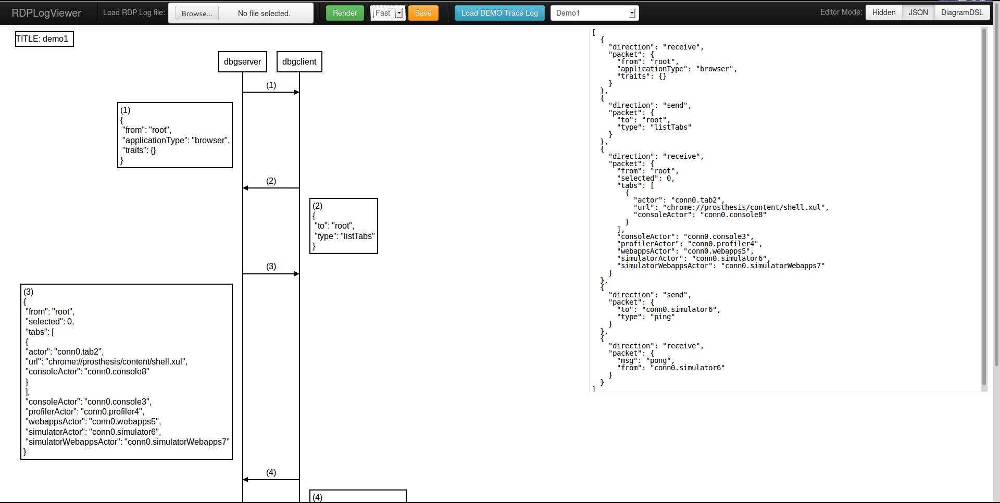
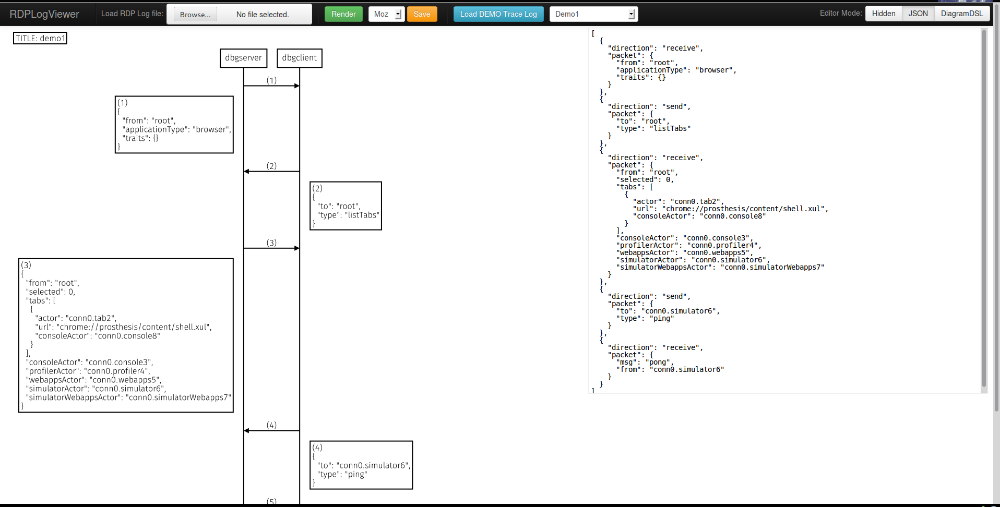
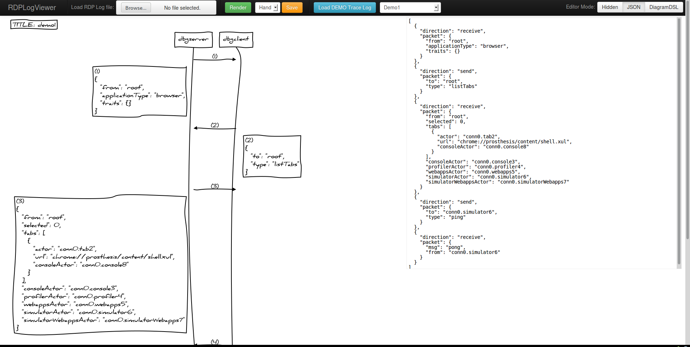

rdp-log-viewer
==============

Status: **PROOF OF CONCEPT**

This small webapp is an experimental viewer / editor for log files
collected by its companion addon-sdk library:

[rdp-logging](https://github.com/rpl/rdp-logging)

Using **rdp-logging** (or another equivalent tool) we can collect
**Mozilla Remote Debugger Procotol** exchanged messages into a
simple json format file, and then (using a viewer like this)
we can render it into a readable sequence diagram (a very simple UML Sequence Diagram)
and optionally tweak it using the embedded editor (e.g. to design a change
in the protocol).

- [RDPLogViewer Sources](https://githun.com/rpl/rdp-log-viewer)

This prototype is based on the following opensource projects:

- [js-sequence-diagrams](https://github.com/bramp/js-sequence-diagrams)
- [Raphaël](https://github.com/DmitryBaranovskiy/raphael)
- [CodeMirror](https://github.com/marijnh/CodeMirror)
- [Bootstrap](https://github.com/twitter/boostrap)
- [Lo-Dash](https://github.com/bestiejs/lodash)
- [jQuery](https://github.com/jquery/jquery)

Screenshots
-----------

### Fast theme

This theme is really fast but doesn't indent json

### Moz theme

This theme is slower than previous one, but it's indent json correctly
and use a readable font (MozTT)

### Hand theme

This theme is really slow, not very readable... but really fun :-)
(this theme was already featured by the official js-sequence-diagrams build)

